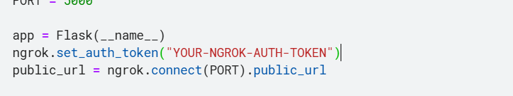
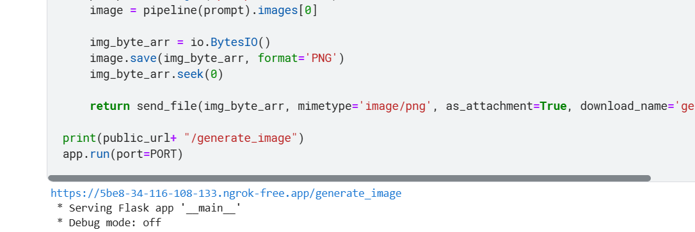
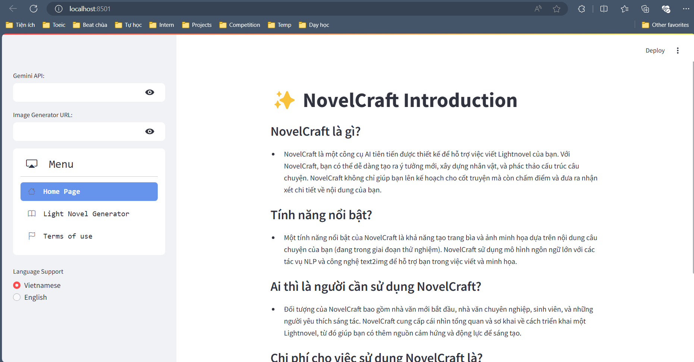
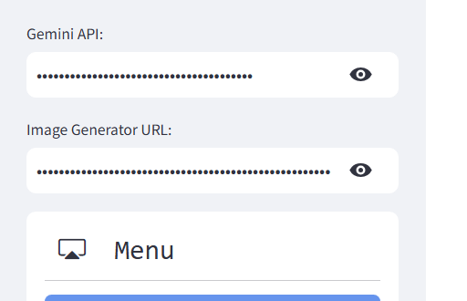
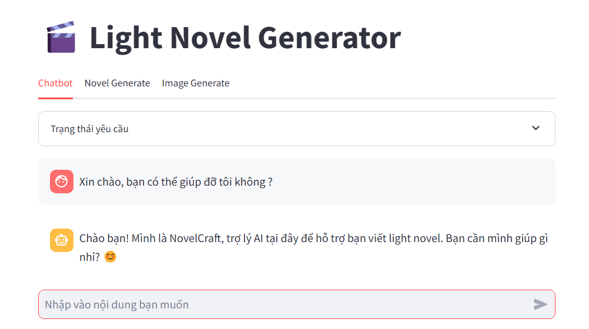
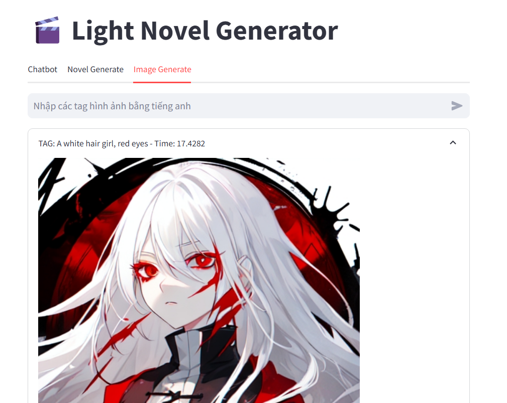
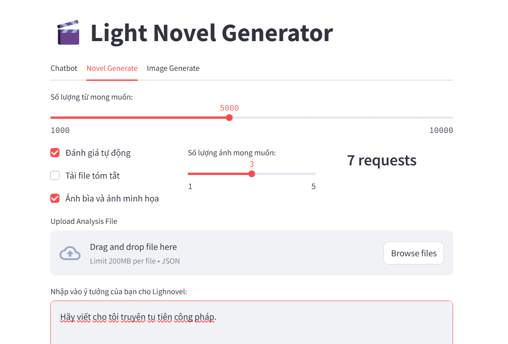
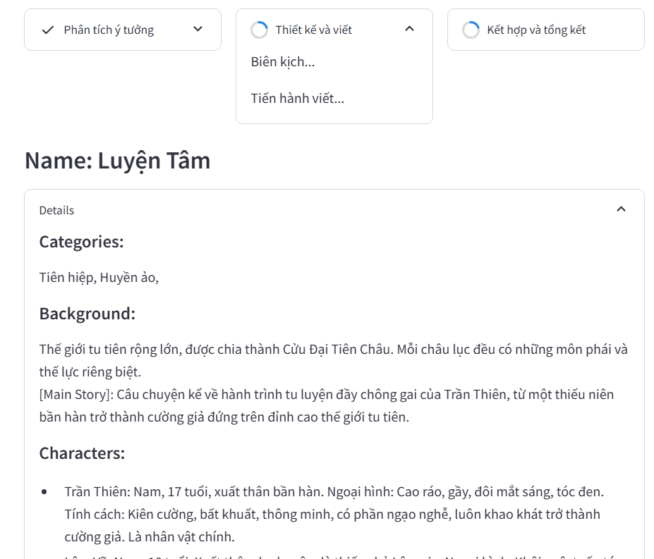
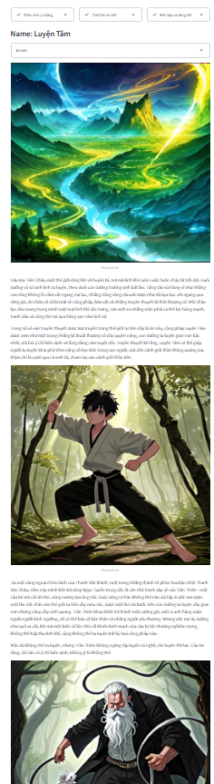
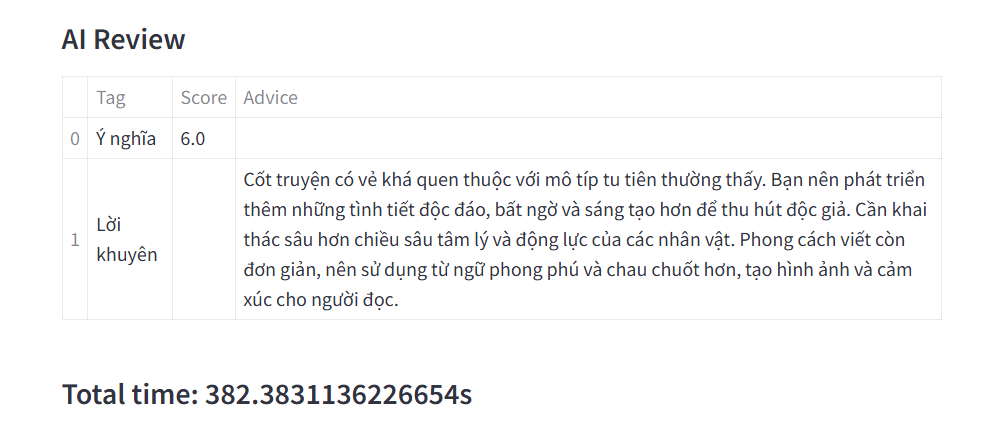

# ✨ NovelCraft

[](https://ai.google.dev/gemini-api)
[](https://huggingface.co/docs/diffusers/index)
[](https://ngrok.com/docs/using-ngrok-with/flask/)
[](https://docs.streamlit.io/)

- **What is NovelCraft?**

NovelCraft is an advanced AI tool designed to assist with your Lightnovel writing. With NovelCraft, you can easily generate new ideas, build characters, and outline your story structure. NovelCraft not only helps you plan your plot but also scores and provides detailed feedback on your content.

- **Key Features?**

A standout feature of NovelCraft is its ability to create cover art and illustrations based on your story content (currently in the experimental phase). NovelCraft uses large language models for NLP tasks and text-to-image technology to support you in both writing and illustrating.

- **Who Should Use NovelCraft?**

NovelCraft is aimed at novice and professional writers, students, and creative enthusiasts. It provides an overview and preliminary insight into developing a Lightnovel, helping you gain inspiration and motivation for your creative projects.

- **Demo**

Tiktok video: https://www.tiktok.com/@tml2504/video/7399913761013861640


# ❓ How to use

**Step 1:** Get the **Gemini API** and **Image Generator URL**

- Get **Gemini API** here: [Google AI Studio - Get API key](https://aistudio.google.com/app/apikey)

- Get **Image Generator URL**:

First, you need to run the ```flask-ngrok-api-diffusers.ipynb``` file with [Colab](https://colab.research.google.com/) or [Kaggle Notebook](https://www.kaggle.com/)

**NOTICE:** Replace the ```YOUR-NGROK-AUTH-TOKEN``` with your Ngrok token.



Copy the URL ```https://XXXX-XX-XX-XXX-XXX.ngrok-free.app/generate_image```



**Step 2:** Run the app.py with Streamlit Application, enter the **Gemini API** and **Image Generator URL**
- Install Requirements

```
pip install -r requirements.txt
```

- Run app.py

```
streamlit run app.py
```



- Enter the **Gemini API** and **Image Generator URL**



**Step 3:** Use the features

- **1. Chatbot**



- **2. Image Generator**



- **3. Lightnovel Generator**

Enter the input idea!



Wait for the analysing and generating!



Full results!



AI Review!



# 🏴󠁧󠁢󠁷󠁬󠁳󠁿 Terms of Use
- **Policy Purpose**

This policy aims to help users understand how NovelCraft operates. NovelCraft will not be held responsible for any copyright claims related to light novels, images, titles, etc. To use NovelCraft, users must have the API of Gemini as well as an API or URL from a related party that allows image generation based on tags.

- **User Rights and Obligations**

Users are allowed to freely use all features of NovelCraft to create light novels or images for personal needs (publication or entertainment, etc.). However, they may not use NovelCraft's name for publication or commercial purposes.

Users must ensure proper use of NovelCraft and not request light novels that are pornographic or contrary to general social morals.

- **Support and Contact**

Users can contact for support through the following information:

**Email:** trongvo250403@gmail.com

**Facebook:** [Trọng Võ](https://www.facebook.com/profile.php?id=100059263009845)

- **Policy Changes and Updates**

This policy may change as new features and operating methods are implemented. Users will be informed of policy changes.

- **Additional Terms and Conditions**

This policy is part of NovelCraft's service agreement.

Continued use of NovelCraft signifies that users agree to the terms and conditions in this policy.
